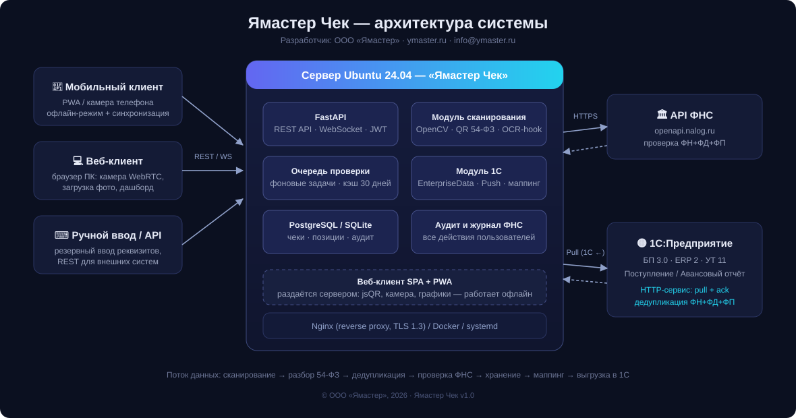
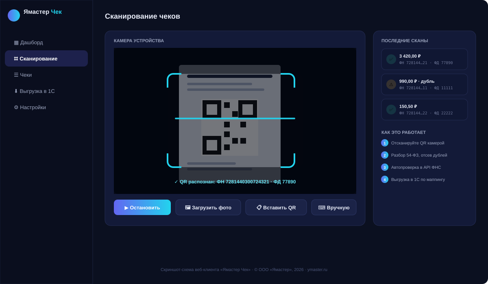
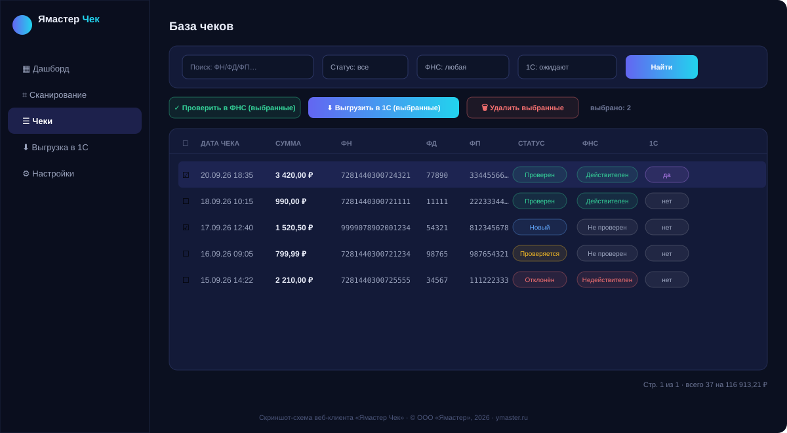
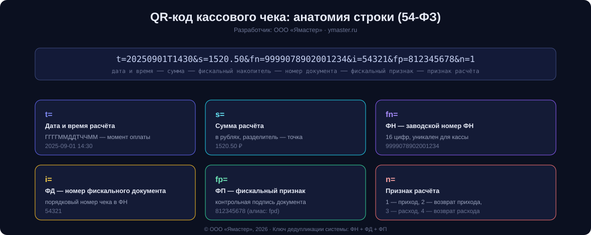

# 🧾 Ямастер Чек

**Система сканирования кассовых чеков и интеграции с 1С:Предприятие**

> **Разработчик и владелец идеи: ООО «Ямастер»**
> 🌐 Сайт: [ymaster.ru](https://ymaster.ru) · ✉️ E-mail: [info@ymaster.ru](mailto:info@ymaster.ru)

Полноценный продукт по ТЗ: сотрудники сканируют QR-коды кассовых чеков (54-ФЗ) с телефона или
веб-камеры, система автоматически разбирает реквизиты, отсекает дубликаты, проверяет чеки через
API ФНС и выгружает их в **1С:Бухгалтерия 3.0 / ERP 2 / УТ 11** по настраиваемому маппингу.



---

## ⚡ Возможности

| Блок | Что умеет |
|---|---|
| **Сканирование** | Камера телефона и ПК (PWA, WebRTC), загрузка фото (drag-and-drop), вставка QR-текста, ручной ввод реквизитов, REST API |
| **Распознавание** | Множественное чтение QR (jsQR на клиенте + OpenCV на сервере), устойчивость к поворотам/шуму/бликам, определение «нескольких чеков на фото» |
| **54-ФЗ** | Разбор `t= s= fn= i= fp= n=` и алиасов (`fpd`, `fd`, URL-варианты ОФД), признаки расчёта 1–4 |
| **Дедупликация** | Ключ **ФН+ФД+ФП** — на сервере и на стороне 1С |
| **Проверка ФНС** | Подключаемое «Открытое API проверки чека ККТ» (openapi.nalog.ru) + демо-провайдер для работы без токена; кэш результатов 30 дней; журнал обращений |
| **Интеграция 1С** | Push-режим (1С забирает чеки сама: `pull` + `ack`), файловый экспорт **EnterpriseData** (JSON/XML), готовый код для 1С в комплекте |
| **Маппинг** | Настраиваемые правила «поле чека → реквизит документа 1С» с преобразованиями (копейки, дата ISO, вид операции, константа) |
| **Аналитика** | Дашборд: KPI, чеки по дням, статусы ФНС, источники, лента событий в реальном времени (WebSocket) |
| **Администрирование** | Пользователи и роли (RBAC), журнал аудита, настройки ФНС/1С, смена токенов из интерфейса |
| **Офлайн-режим** | PWA ставится на телефон как приложение; сканы без связи сохраняются локально и синхронизируются автоматически |
| **Безопасность** | JWT (HS256), PBKDF2-260k пароли, токены для 1С, защита от SQL-инъекций (ORM), CORS, Nginx+TLS |

## 👥 Роли и доступ

| Роль | Права |
|---|---|
| **Администратор** (всегда один) | Абсолютно всё: пользователи, приглашения, настройки, журнал, передача прав |
| **Бухгалтер** | Все чеки, проверка ФНС, назначение сотрудника, выгрузка в 1С/CSV, маппинг |
| **Пользователь** | Сканирование и просмотр только своих чеков |

- Регистрация — **только по ссылке-приглашению** от администратора, роль вшита в ссылку;
- Администратор заходит первым (`admin`/`admin123`) — система **обязательно** требует сменить пароль;
- Второго администратора создать нельзя; права передаются кнопкой «Сделать администратором».

## 🛡 Защита (всё бесплатно, из коробки)

Rate-limit (antibrute + анти-DoS) · блокировка перебора паролей · UFW (наружу только 80/443) ·
fail2ban (бан IP) · Nginx limit_req/conn · CSP/security headers · JWT+PBKDF2 · один админ ·
приглашения · systemd-изоляция. Подробности: [docs/DEPLOYMENT.md](docs/DEPLOYMENT.md), раздел 4.

## 🚀 Быстрый старт (2 минуты)

Нужен Python 3.11+ (Ubuntu 24.04 — из коробки):

```bash
cd 1c_chek
pip3 install -r requirements.txt       # зависимости
python3 -m app.seed --demo             # админ + маппинг + 36 демо-чеков
python3 run.py --port 8000             # запуск
```

Откройте **http://localhost:8000** и войдите:

| Логин | Пароль |
|---|---|
| `admin` | `admin123` |

> ⚠️ После первого входа смените пароль: **Настройки → Мой профиль**.

Больше демо-чеков: кнопка **«Загрузить демо-чеки»** на пустом дашборде.

### Продакшен одной командой (Docker)

```bash
cp .env.example .env        # заполните SECRET_KEY и настройки
docker compose up -d --build
# Веб-клиент: http://<сервер>:8000 · Swagger: http://<сервер>:8000/api/docs
```

### Продакшен на сервере Ubuntu 24.04 прямо из GitHub

```bash
ssh root@ВАШ_IP
curl -fsSL https://raw.githubusercontent.com/Rimlin-UNC/1c_chek/arena/01a0caaa-1c-chek/deploy.sh -o deploy.sh
sudo bash deploy.sh                       # код с GitHub + Nginx + UFW + fail2ban
sudo bash deploy.sh --update              # обновление версии
sudo bash deploy.sh --with-ssl=домен.ru   # + HTTPS
```

(Классическая установка также доступна: `sudo bash install.sh --with-nginx --with-ssl=check.example.ru`.)

Скрипт создаст пользователя, развернёт приложение в `/opt/ymaster-check`, настроит
systemd-автозапуск, Nginx и SSL Let's Encrypt. Подробности — [docs/DEPLOYMENT.md](docs/DEPLOYMENT.md).

## 📱 Как пользоваться



1. **Сканирование** — наведите камеру на QR-код чека (или перетащите фото чека в окно,
   или вставьте QR-текст, или введите реквизиты вручную).
2. Система разбирает реквизиты и показывает чек в базе; дубликаты отсекаются автоматически.
3. **Чеки** — отметьте нужные и нажмите «Проверить в ФНС». Статусы обновляются в реальном времени.
4. **Выгрузка в 1С** — скачайте пакет EnterpriseData или настройте Push-режим, чтобы 1С
   забирала чеки сама по HTTP.



Полная инструкция с картинками: **[docs/USER_GUIDE.md](docs/USER_GUIDE.md)** 📖

## 🟡 Интеграция с 1С



- **Push-режим (рекомендуется):** регламентное задание 1С опрашивает сервер
  (`GET /onec/v1/receipts/pull`, заголовок `X-API-Token`) и подтверждает загрузку (`POST /onec/v1/receipts/ack`).
  Готовый модуль для 1С: [integration_1c/РегламентноеЗадание_ЗагрузкаЧековЯмастер.bsl](integration_1c/РегламентноеЗадание_ЗагрузкаЧековЯмастер.bsl).
- **Файловый режим:** кнопка «Выгрузить в 1С» формирует пакет EnterpriseData (JSON/XML).
- Дедупликация в 1С — по регистру сведений с ключом ФН+ФД+ФП.

Пошаговая настройка: **[docs/INTEGRATION_1C.md](docs/INTEGRATION_1C.md)**

## 🔌 API

Автодокументация Swagger: **`/api/docs`** · ReDoc: **`/api/redoc`** · OpenAPI: `/api/openapi.json`

Основные эндпоинты:

| Метод | Путь | Описание |
|---|---|---|
| POST | `/api/v1/auth/login` | Получение JWT-токена |
| POST | `/api/v1/receipts/scan` | Приём строки QR-кода |
| POST | `/api/v1/receipts/scan/image` | Приём изображения (сервер находит QR через OpenCV) |
| POST | `/api/v1/receipts/manual` | Ручной ввод реквизитов |
| GET | `/api/v1/receipts` | Список чеков (фильтры, поиск, пагинация) |
| POST | `/api/v1/receipts/verify` | Проверка чеков в ФНС (асинхронно) |
| POST | `/api/v1/receipts/export` | Экспорт EnterpriseData в 1С |
| GET/PUT | `/api/v1/settings/mapping` | Настройки маппинга реквизитов |
| WS | `/ws/status` | Живые статусы обработки |

Интеграция 1С: `GET /onec/v1/ping` · `GET /onec/v1/receipts/pull` · `POST /onec/v1/receipts/ack` ·
`GET /onec/v1/enterprise-data?format=json|xml`.

## 🏛 Проверка чеков через ФНС

По умолчанию включён **демо-провайдер** (система полностью работоспособна, но чеки не
проверяются в реальной ФНС). Для боевого режима:

1. Получите **Мастер-токен** ФНС (заявка в ФНС — инструкция: [docs/knowledge/fns_auth.md](docs/knowledge/fns_auth.md));
2. **Настройки → Проверка чеков (ФНС)** → переключите на «Реальное API ФНС» и вставьте токен.

## 🗂 Структура проекта

```
1c_chek/
├── app/                    # Backend (FastAPI)
│   ├── main.py             #   приложение, WebSocket, раздача SPA
│   ├── models.py           #   ORM-модели (чеки, позиции, маппинг, пользователи, аудит)
│   ├── routers/            #   API: чеки, настройки, пользователи, 1С, аналитика
│   ├── services/           #   QR 54-ФЗ, OpenCV-сканирование, ФНС, экспорт, события
│   └── static/             #   Веб-клиент SPA + PWA (jsQR, графики, офлайн-режим)
├── integration_1c/         # Готовый код для 1С (BSL)
├── docs/                   # Документация: руководство, деплой, 1С, база знаний
│   └── img/                # Диаграммы и схемы интерфейса
├── deploy/                 # Nginx, systemd
├── tests/                  # Тесты (pytest)
├── install.sh              # Установка на Ubuntu 24.04 одной командой
├── Dockerfile / docker-compose.yml
└── requirements.txt
```

## 🧪 Тесты

```bash
python3 -m pytest tests/ -v
```

## 🛠 Технологии

FastAPI · SQLAlchemy 2 · OpenCV · jsQR · WebSocket · JWT/PBKDF2 · Vanilla JS SPA + PWA ·
SVG-графики без зависимостей · PostgreSQL 17 / SQLite · Docker · Nginx · systemd.

Требования ТЗ выполнены: множественное чтение QR, OCR-точка расширения (`app/services/imaging.py`),
дедупликация, гибкий маппинг, офлайн-режим, аналитика, API-first, аудит — см.
[docs/SPECIFICATION.md](docs/SPECIFICATION.md) (исходное ТЗ) и [CHANGELOG.md](CHANGELOG.md).

---

© 2026 **ООО «Ямастер»** — разработка и идея · [ymaster.ru](https://ymaster.ru) · info@ymaster.ru
Лицензия MIT (файл [LICENSE](LICENSE)).
