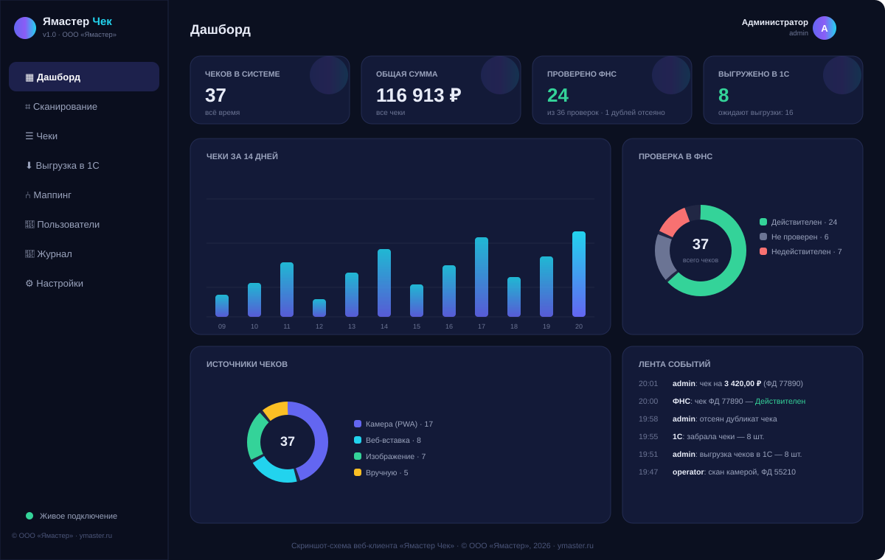

# 📖 Руководство пользователя «Ямастер Чек»

> **Разработчик и владелец идеи: ООО «Ямастер»**
> Сайт: [ymaster.ru](https://ymaster.ru) · E-mail: [info@ymaster.ru](mailto:info@ymaster.ru)
> Версия документа: 1.0 (22.09.2026)

---

## Содержание

1. [Что это за система](#1-что-это-за-система)
2. [Вход в систему](#2-вход-в-систему)
3. [Установка на телефон (PWA)](#3-установка-на-телефон-pwa)
4. [Сканирование чеков](#4-сканирование-чеков)
5. [Работа с базой чеков](#5-работа-с-базой-чеков)
6. [Проверка чеков в ФНС](#6-проверка-чеков-в-фнс)
7. [Выгрузка в 1С](#7-выгрузка-в-1с)
8. [Маппинг реквизитов](#8-маппинг-реквизитов)
9. [Дашборд и аналитика](#9-дашборд-и-аналитика)
10. [Настройки и администрирование](#10-настройки-и-администрирование)
11. [Частые вопросы и решение проблем](#11-частые-вопросы-и-решение-проблем)

---

## 1. Что это за система

**Ямастер Чек** — рабочее место для сбора кассовых чеков и передачи их в 1С.
Вместо ручного ввода реквизитов сотрудник сканирует QR-код с чека — система сама
извлекает дату, сумму, ФН, ФД, ФП, проверяет чек в ФНС и передаёт в 1С.


**Сквозной процесс:** сканирование → разбор 54-ФЗ → отсев дубликатов → проверка ФНС →
хранение → маппинг → выгрузка в 1С.

Роли в системе (регистрация — только по приглашению администратора, роль выдаётся ссылкой):

| Роль | Права |
|---|---|
| **Пользователь** | Сканирует чеки (камера/фото/вручную), видит **только свои** чеки. Проверку и выгрузку делает бухгалтер |
| **Бухгалтер** | Всё, что пользователь + все чеки, проверка в ФНС, назначение сотрудника, выгрузка в 1С и CSV, маппинг (просмотр) |
| **Администратор** | Абсолютно все права: пользователи и приглашения, настройки ФНС/1С, маппинг, удаление любых чеков, журнал. **Администратор всегда один** — права передаются специальной кнопкой |

---

## 2. Вход в систему

1. Откройте адрес сервера в браузере, например `http://адрес-сервера:8000`.
2. Введите логин и пароль (выдаёт администратор; при первой установке — `admin` / `admin123`).
3. Нажмите **«Войти в систему»**.

**Первый вход администратора:** пароль `admin123` — временный. Система **сама потребует**
задать собственный пароль (окно «Смените пароль», без него дальше не пустить).

**Регистрация сотрудников** возможна **только по ссылке-приглашению** от администратора
(раздел «Пользователи → + Создать приглашение»). Роль (бухгалтер/пользователь) вшита
в приглашение — путаницы не бывает. Перебор паролей блокируется автоматически
(5 неудачных попыток → пауза 15 минут).

> Сессия живёт 12 часов, затем потребуется повторный вход.

---

## 3. Установка на телефон (PWA)

Веб-клиент — это PWA: его можно поставить на телефон как обычное приложение.

**Android (Chrome):** откройте адрес сервера → меню ⋮ → **«Установить приложение»**.
**iPhone (Safari):** кнопка «Поделиться» → **«На экран “Домой”»**.

После установки на телефоне появится иконка «Ямастер Чек», приложение откроется
в полный экран и сможет использовать камеру для сканирования.

**Офлайн-режим:** если связь с сервером пропала, сканы не теряются — они сохраняются
на устройстве (счётчик виден рядом с пунктом меню «Сканирование») и автоматически
отправятся при появлении сети.

---

## 4. Сканирование чеков


Раздел **«Сканирование»** — четыре способа добавить чек:

### 4.1. Камера (основной способ)
1. Нажмите **«▶ Включить камеру»** и разрешите доступ.
2. Наведите камеру так, чтобы QR-код чека попал в рамку.
3. Код распознается автоматически — прозвучит короткий сигнал, чек появится в списке справа.

Можно сканировать чеки подряд: камера остаётся включённой, повторное распознавание
того же чека игнорируется 2,5 секунды, чтобы не было случайных дублей.

### 4.2. Фото чека (загрузка изображения)
Нажмите **«🖼 Загрузить фото»** или перетащите фотографии в пунктирную зону — можно
несколько сразу. Изображение обрабатывается в два этапа: сначала на устройстве (быстро),
затем, если QR не найден, — на сервере устойчивым алгоритмом OpenCV (повороты, шум, блики).

> Если на одной фотографии окажутся **разные** чеки, система покажет список найденных
> и предложит выбрать, какие добавить.

### 4.3. Вставка QR-текста
Если строка QR уже есть в буфере обмена (например, из другого приложения), нажмите
**«📋 Вставить QR-текст»** и вставьте её. Пример строки:

```
t=20250901T1430&s=1520.50&fn=9999078902001234&i=54321&fp=812345678&n=1
```


### 4.4. Ручной ввод (резервный)
Если QR повреждён, нажмите **«⌨ Ввести вручную»** и заполните реквизиты с бумажного чека:
дата и время, сумма, ФН, ФД, ФП, признак расчёта (приход/возврат).

> Все способы защищены дедупликацией: повторный чек по ключу **ФН+ФД+ФП** в базу
> повторно не попадает — вы увидите предупреждение «Дубликат отсеян».

---

## 5. Работа с базой чеков


Раздел **«Чеки»** — таблица всех чеков с фильтрами:

- **Поиск** — по номерам ФН/ФД/ФП и строке QR;
- **Статус** — новый / проверяется / проверен / отклонён ФНС;
- **Проверка ФНС** — действителен / недействителен / не найден / не проверен;
- **Выгрузка в 1С** — ожидают выгрузки / выгружены;
- **Даты** — период по дате чека.

**Массовые действия:** отметьте чеки галочками — станут активны кнопки:

| Кнопка | Действие |
|---|---|
| ✓ Проверить в ФНС | отправить выбранные чеки на проверку |
| ✓✓ Проверить все новые | отправить на проверку все необработанные |
| ⬇ Выгрузить в 1С | сформировать пакет выгрузки по выбранным |
| 🗑 Удалить | удалить выбранные чеки (выгруженные — только админ) |

Клик по строке открывает **карточку чека**: полная строка QR (копируется нажатием),
реквизиты, ответ ФНС, позиции чека (если пришли от ФНС/ОФД), история выгрузки.

### 5.1. Сотрудник (подотчётник) — главная кнопка для бухгалтера

Чтобы не вносить чеки руками в авансовые отчёты:

1. Отметьте галочками чеки сотрудника;
2. Нажмите **«👤 Назначить сотрудника»** и выберите ФИО (система подсказывает ранее введённые);
3. Выгрузите в 1С — ФИО попадёт в поле «Контрагент» документа, авансовый отчёт заполнится сам.

Сотрудника можно указать и в карточке чека (клик по строке → «Для бухгалтерии»).
Также доступна **«📊 CSV-сводка»** — Excel-файл по выбранным чекам для быстрой проверки.

---

## 6. Проверка чеков в ФНС

Статусы проверки:

| Статус | Значение |
|---|---|
| 🟦 Новый | чек добавлен, проверка не запускалась |
| 🟨 Проверяется | запрос в ФНС выполняется |
| 🟩 Действителен | чек найден в ФНС, фискальный признак совпал |
| 🟨 Не найден | ФНС пока не знает чек (ОФД мог не передать — проверьте позже) |
| 🟥 Недействителен | контроль не пройден — чек вызывает сомнения |

Результаты приходят в интерфейс мгновенно (WebSocket) — уведомление появится
в правом нижнем углу, статусы обновятся сами.

**Демо-провайдер:** если администратор ещё не подключил реальное API ФНС, проверки
выполняет встроенный имитатор — statuses меняются так же, но в реальную ФНС запросы не ходят.
Как подключить реальную ФНС — см. раздел 10 и [docs/knowledge/fns_auth.md](knowledge/fns_auth.md).

**Кэш:** повторная проверка чека в течение 30 дней не отправляет запрос в ФНС —
используется сохранённый результат (экономия лимитов API).

---

## 7. Выгрузка в 1С

Раздел **«Выгрузка в 1С»** — два способа передачи чеков:

### 7.1. Файловый экспорт (просто и быстро)
1. Выберите документ 1С (**Поступление товаров и услуг** / **Авансовый отчёт** / **ПКО**).
2. Выберите формат **EnterpriseData JSON** или **XML**.
3. Нажмите **«⬇ Выгрузить ожидающие»** — скачается файл, чеки пометятся как выгруженные.
4. Загрузите файл в 1С (обработка загрузки EnterpriseData / вручную по вашей процедуре).

Повторная выгрузка тех же чеков в 1С **не создаст дублей** — 1С отсекает их по ключу ФН+ФД+ФП.

### 7.2. Push-режим (1С забирает сама — рекомендуется)
1. Администратор: **Настройки → Интеграция с 1С** → кнопка «показать» — скопируйте токен.
2. В 1С настройте регламентное задание по готовому модулю
   [integration_1c/РегламентноеЗадание_ЗагрузкаЧековЯмастер.bsl](../integration_1c/РегламентноеЗадание_ЗагрузкаЧековЯмастер.bsl)
   (пошагово — [docs/INTEGRATION_1C.md](INTEGRATION_1C.md)).
3. 1С периодически забирает новые проверенные чеки и подтверждает загрузку.

Проверить связь можно в браузере: `http://сервер/onec/v1/ping` с заголовком `X-API-Token`.

---

## 8. Маппинг реквизитов

Раздел **«Маппинг»** (администратор) определяет, **какое поле чека в какой реквизит 1С попадёт**.

Каждое правило — строка: *поле чека → документ 1С → реквизит → преобразование*.

| Поле чека | Примеры реквизитов 1С | Преобразования |
|---|---|---|
| `total_sum` (сумма) | СуммаДокумента | «Сумма в копейки» (×100) |
| `receipt_date` (дата) | Дата | «Дата в ISO 8601» |
| `fn`, `fd`, `fp` | ФН, ФД, ФП | «Как есть» |
| `operation` (признак) | ВидОперации | «Признак → ВидОперации» (Приход/ВозвратПрихода) |
| `qr_data` (строка QR) | Комментарий | «Как есть» |
| — | любой реквизит | «Константа» (параметр правила) |

Правила применяются и в файловом экспорте, и в Push-режиме. Изменения вступают
в силу сразу после сохранения.

---

## 9. Дашборд и аналитика



Главный экран показывает:

- **KPI** — количество чеков, общая сумма, сколько проверено ФНС, сколько выгружено в 1С;
- **График по дням** — динамика сканирования за 14 дней (наведите курсор для деталей);
- **Кольцевые диаграммы** — статусы проверки ФНС и источники чеков;
- **Лента событий** — кто, когда и что делал (сканы, проверки, выгрузки, входы).

Данные обновляются в реальном времени: отсканированный кем-то чек появляется
в аналитике без перезагрузки страницы.

---

## 10. Настройки и администрирование

### Настройки → Проверка чеков (ФНС)
- **Демо (mock)** — имитация проверки, для обучения и демо (по умолчанию).
- **Реальное API ФНС** — вставьте Мастер-токен (как получить: [docs/knowledge/fns_auth.md](knowledge/fns_auth.md)).

### Настройки → Интеграция с 1С
- Токен Push-доступа и его перевыпуск (кнопка «♻ Сгенерировать»).
  После перевыпуска обновите токен в 1С.

### Пользователи (админ)
Создание учётных записей, роли (администратор/оператор), отключение, сброс пароля.
Удаление — «архивация»: пользователь отключается, но история аудита сохраняется.

### Журнал (админ)
Полный аудит: входы, сканы, дубликаты, проверки, выгрузки, изменения настроек —
кто и когда.

---

## 11. Частые вопросы и решение проблем

**Камера не включается.**
Браузер не дал доступ: проверьте разрешение камеры для сайта (иконка 🔒 в адресной строке).
Камера работает только по HTTPS или на `localhost` — при деплое настройте SSL (install.sh делает это сам).

**QR не распознаётся с фото.**
Улучшите условия: держите чек ровно, избегайте бликов и теней; растяните фото с чеком
на весь экран другого телефона и отсканируйте камерой. Крайний случай — ручной ввод.

**Чек «Не найден в ФНС».**
ОФД мог не успеть передать данные (до 3 суток). Повторите проверку позже. Если чек
своих денег стоит — проверьте реквизиты вручную.

**Статус «Проверяется» висит долго.**
Проверка выполняется в фоне; при недоступности API ФНС чек вернётся в статус «Новый» —
повторите. Журнал обращений к ФНС виден админу в базе (`fns_log`).

**Забыли пароль администратора.**
На сервере: `cd /opt/ymaster-check && sudo -u ymaster ./venv/bin/python -c`
`"from app.seed import DEFAULT_ADMIN; print(DEFAULT_ADMIN)"` — а сброс пароля
выполняет другой администратор через раздел «Пользователи». Если админ один —
создайте нового командой из документации DEPLOYMENT.md (раздел «Аварийный доступ»).

**Дубликат отсеивается, а чек в базе не вижу.**
Значит чек уже есть — включите фильтр «1С: все» и найдите его по ФД.

---

## Поддержка

**ООО «Ямастер»** · сайт: [ymaster.ru](https://ymaster.ru) · почта: [info@ymaster.ru](mailto:info@ymaster.ru)

© 2026 ООО «Ямастер». Все права на систему принадлежат правообладателю.
